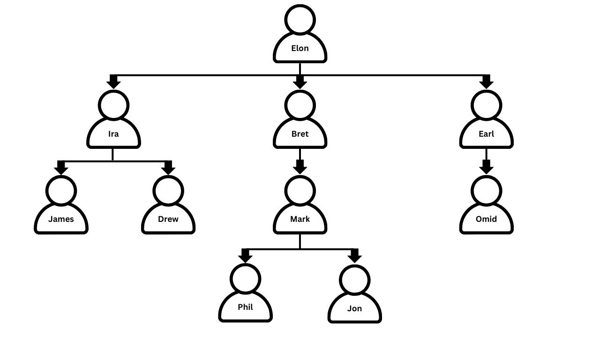

# Company Structure

---

## 🛠️ Problem Statement

<b>Table Name : company</b>
 
|  Column Name  |Type |
| ------------- | ------------- |
| employee    | varchar(10) |
| manager     | varchar(10)    |

* <b> employee is the primary key for this table. </b> 
 

This table provides employee name and their manager name.
 

Given graph shows the hierarchy of employees in a company. 
Write an SQL query to split the hierarchy and show the employees corresponding to their team.
 

 
Assumption: Assume that the total number of teams are the same as the number of people reporting to the person at top.

 
Return the result table in any order.
 
 
<b>The query result format is in the following example:  </b>
 
 

 

Input

 
<b>Table Name : company</b>
  

| employee | manager |
|----------|---------|
| Elon     |         |
| Ira      | Elon    |
| Bret     | Elon    |
| Earl     | Elon    |
| James    | Ira     |
| Drew     | Ira     |
| Mark     | Bret    |
| Phil     | Mark    |
| Jon      | Mark    |
| Omid     | Earl    |

Output

 

| team    | members |
| ---- |----|
| Team 1   | Elon ,Bret, Jon, Mark, Phil |
| Team 2   | Elon ,Earl, Omid |
| Team 3   | Elon ,Drew, Ira, James |

---
